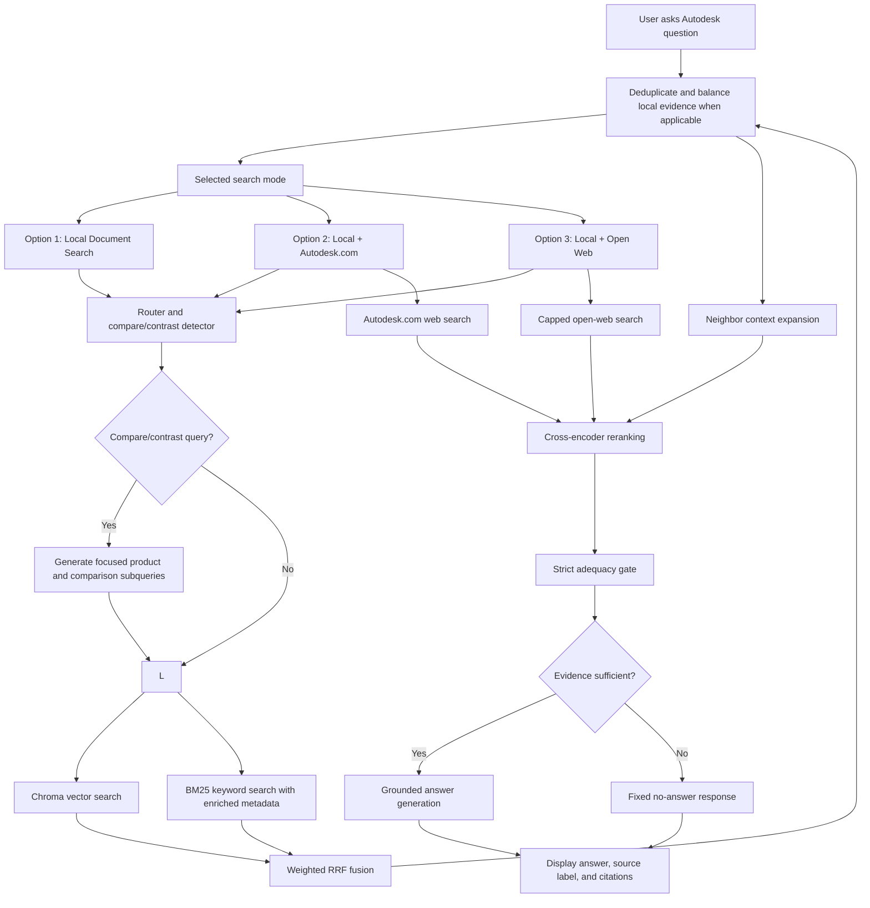
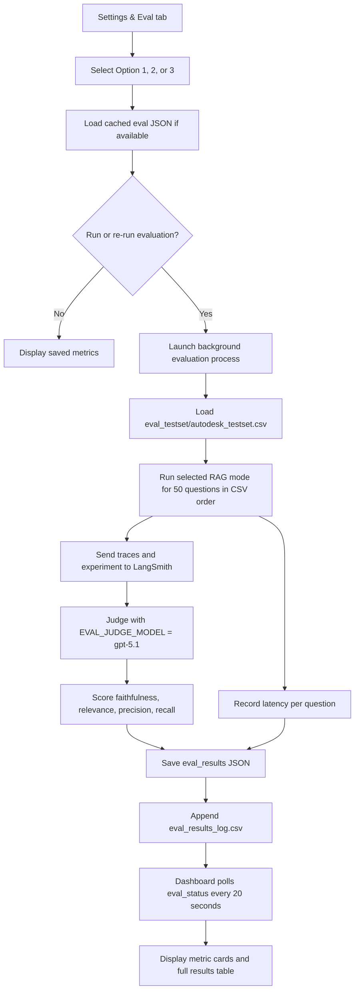

# Autodesk Agentic RAG Flow Logic

This document describes the current application flow in diagram-ready but implementation-aware language. It is intended to explain how the Streamlit app, retrieval indexes, web-search options, reranker, adequacy gate, answer generator, and evaluation workflow fit together.

## High-Level Purpose

The app answers user questions about Autodesk and Autodesk products using a conservative Retrieval-Augmented Generation workflow. It prioritizes local Autodesk corpus evidence, optionally adds web evidence depending on the selected runtime option, reranks evidence with a local cross-encoder, and answers only when the supplied context explicitly supports the response.

The fixed no-answer response is:

```text
I could not find a reliable answer in the available documents or web sources.
```

## Runtime Search Options

| Option | UI Label | Local Retrieval | Web Retrieval | Intended Use |
|---|---|---|---|---|
| 1 | Local Document Search | Chroma vector search plus BM25 keyword search over the local Autodesk corpus | Disabled | Fastest, most controlled local-corpus mode |
| 2 | Local Document Search + Autodesk.com | Same local hybrid retrieval | SerpAPI Google Search restricted to `autodesk.com/*`, always included | Best mode for current official Autodesk product, version, pricing, support, or subscription information |
| 3 | Local Document Search + Open Web Search | Same local hybrid retrieval | SerpAPI open web search, capped at a small result count, always included | Useful for broad web corroboration, but less authoritative than Option 2 |

All three options use the same local retrieval backend:

- Chroma dense vector search
- BM25 lexical search
- Weighted Reciprocal Rank Fusion
- Compare/contrast retrieval planning for product comparison and product-selection questions
- Same-document neighbor context expansion
- Cross-encoder reranking before the adequacy gate

## Main User-Facing Flow

### Step 1: User Opens Streamlit App

- The user starts the app with Streamlit.
- The app opens in the browser, typically at `http://localhost:8502`.
- The terminal prints friendly color-coded startup instructions, including how to stop the app with `Ctrl+C`.
- The interface shows three tabs:
  - Ask
  - Settings & Eval
  - About the App

### Step 2: User Selects Search Mode

- The user opens **Settings & Eval**.
- A vertical radio button group presents the three options.
- The selected option is stored in Streamlit session state.
- The selected mode controls whether web evidence is disabled, restricted to Autodesk.com, or open web.
- The selection persists across app reruns and evaluation auto-refreshes.

### Step 3: User Asks a Question

- The user enters an Autodesk-relevant question in the Ask tab.
- The app appends the user question to chat history.
- The app displays newest conversations above older conversations.
- The app passes the question and selected search mode to the RAG agent.

### Step 4: Search Mode Policy Is Applied

Option 1:

- The app uses only local documents.
- The lightweight router does not decide whether web search is needed.
- Web search is not attempted.
- Compare/contrast questions can still trigger local compare retrieval planning.

Option 2:

- The app uses local documents.
- The app also always retrieves web evidence from Autodesk.com through SerpAPI.
- Web results are restricted to official Autodesk pages.
- This is the preferred mode for current or latest official product information.

Option 3:

- The app uses local documents.
- The app also always retrieves capped open-web evidence through SerpAPI.
- Open-web evidence is not restricted to Autodesk.com.
- The lower result cap reduces latency and noise.
- The adequacy gate can still reject an answer if the open-web evidence is not authoritative or explicit enough.

## Local Hybrid Retrieval Flow

Local retrieval runs in every option.

Before local retrieval, the agent checks whether the user question is a compare/contrast, product-selection, difference, or `X vs Y` style query. This branch is deterministic and lives in `src/agent.py`; it preserves the normal router behavior for non-comparison questions.

Compare/contrast detection includes patterns such as:

- `compare`
- `contrast`
- `difference between`
- `differences between`
- `vs`
- `versus`
- `which is better`
- `which should I use`
- `should I use`
- `how does X differ from Y`

If a compare/contrast query is detected:

- The agent extracts product or entity names from the user query without hardcoding a specific product pair.
- The original user query remains part of the retrieval strategy.
- Up to four focused retrieval subqueries are generated for product-specific evidence, direct comparison evidence, and comparison dimensions such as use cases, workflows, industries, features, interoperability, BIM/CAD differences, 2D/3D modeling, design documentation, collaboration, and target users.
- The original question and focused subqueries are folded into one expanded local retrieval query.
- Retrieved local chunks are deduplicated before final local context selection.
- Context selection prefers balance across the compared products so one product's highest-scoring pages do not dominate the evidence passed downstream.

This branch improves evidence retrieval and uses a compare-aware adequacy check. A direct comparison passage is not required when retrieved evidence separately provides substantive facts about each compared product. It does not create canned answers, inject product claims, or special-case pairs such as AutoCAD and Revit. The answer generator still requires explicit support from retrieved evidence.

### Step 1: Dense Vector Retrieval

- The user question is embedded with `OPENAI_EMBEDDING_MODEL`, currently `text-embedding-3-small`.
- Chroma searches `retrieval_indexes/chroma_autodesk_cleaned_corpus`.
- Dense retrieval is useful when source text and query wording differ semantically.

### Step 2: BM25 Lexical Retrieval

- The user question is tokenized with the project BM25 tokenizer.
- BM25 searches `retrieval_indexes/bm25_autodesk_cleaned_corpus`.
- BM25 is useful for exact product names, version names, technical phrases, API-like terms, plan names, and section-like wording.

The BM25 index is built from a dedicated `bm25_text` field. This field includes each chunk's body text plus selected enriched cleaned-corpus front matter:

- `subheadings`
- `headings`
- `tfidf_keywords`
- `document_language`
- `document_language_name`

Dense embeddings remain cleaner and use only title, section, source, and chunk text.

### Step 3: Candidate Depth

Default local candidate behavior:

- Dense semantic candidate depth: `HYBRID_CANDIDATE_K=30`
- BM25 candidate depth: `HYBRID_CANDIDATE_K=30`
- Vector weight: `HYBRID_VECTOR_WEIGHT=0.65`
- BM25 weight: `HYBRID_BM25_WEIGHT=0.35`
- Per-source cap: `HYBRID_MAX_PER_SOURCE=3`

The vector-heavy weighting helps reduce cases where BM25 over-rewards title keyword matches while still preserving exact-term recall.

### Step 4: Weighted Reciprocal Rank Fusion

- Dense and BM25 result rankings are combined with weighted Reciprocal Rank Fusion.
- Duplicate chunks are removed.
- The fused list preserves high-quality semantic matches while allowing strong lexical matches to surface.
- The final local candidate list is capped before context expansion.
- In compare/contrast mode, this retrieval process runs once with the expanded comparison query, then local candidates are deduplicated and balanced by mentioned product/entity where possible.

## Deterministic Context Expansion

Context expansion runs after initial local retrieval and before cross-encoder reranking.

Current behavior:

- `CONTEXT_EXPANSION_ENABLED=true`
- `CONTEXT_EXPANSION_MODE=neighbors`
- `CONTEXT_NEIGHBOR_WINDOW=1`
- `CONTEXT_MAX_EXPANDED_DOCS=8`
- `CONTEXT_MAX_CHARS=18000`

For each retrieved local chunk, the app attempts to add:

- previous same-document chunk: `chunk_index - 1`
- retrieved chunk: `chunk_index`
- next same-document chunk: `chunk_index + 1`

Important ordering rules:

- Retrieval priority is preserved globally.
- Expanded groups are processed in original retrieval rank order.
- Within each retrieved group, chunks are ordered by chunk index.
- The app does not globally sort expanded chunks by source, page, title, or document name.
- The context budget is applied after retrieval-priority ordering.
- Lower-ranked expanded groups are trimmed before higher-ranked evidence.

Important constraints:

- No page-based expansion is used.
- No full-page context is used.
- Context sidecars contain chunk records only.
- If `chunk_index` or a chunk sidecar is missing, the app keeps the retrieved chunk and logs that neighbor expansion was skipped.

The goal is to reduce false refusals caused by chunk boundaries without letting long, lower-ranked pages displace higher-ranked evidence.

## Web Evidence Flow

Web evidence is controlled by the selected option.

### Option 1: No Web Search

- No SerpAPI search is run.
- The answer must be supported by local evidence only.

### Option 2: Autodesk.com Web Search

- SerpAPI Google Search runs for every question.
- Results are restricted to Autodesk.com pages.
- Up to 5 Autodesk.com web results are used.
- Web snippets and URLs are converted into evidence blocks.
- Official Autodesk web evidence can help answer current, latest, pricing, plan, version, or support questions.

### Option 3: Open Web Search

- SerpAPI Google Search runs for every question.
- Results are not restricted to Autodesk.com.
- Open-web results are capped at 3 to reduce latency and noise.
- Snippets and URLs are converted into evidence blocks.
- The adequacy gate may reject an answer if the evidence is too thin, stale, third-party, or not explicit enough.

## Cross-Encoder Reranking

After local expansion and optional web retrieval, all evidence blocks are reranked together.

Reranker:

```text
cross-encoder/ms-marco-MiniLM-L6-v2
```

Source package:

```text
sentence-transformers
```

Reranking behavior:

- The reranker scores `(question, evidence passage)` pairs.
- Local chunks and web snippets compete in the same reranked evidence set.
- The top `RERANKER_TOP_N` evidence blocks are passed forward.
- This happens before the adequacy gate.

Why this matters:

- The adequacy gate sees the best evidence candidates rather than raw retrieval order.
- Web evidence in Options 2 and 3 can be promoted when it is more relevant than stale local evidence.
- Weak web snippets can be demoted before they affect the gate or answer generator.

## Evidence Adequacy Gate

The adequacy gate is a strict evidence sufficiency checker. It does not answer the user question.

Current order:

1. Apply the router and selected web policy.
2. Detect compare/contrast intent when present.
3. Retrieve local candidates, using one expanded focused query for compare/contrast questions.
4. Expand same-document local neighbors.
5. Add web snippets if Option 2 or Option 3 is selected.
6. Rerank all evidence blocks with the cross-encoder.
7. Run the adequacy gate on the best reranked evidence.
8. Generate an answer only if the gate finds sufficient evidence.

Gate behavior:

- Uses only supplied evidence.
- Does not use memory, prior turns, outside knowledge, or likely values.
- For numeric, date, fee, version, plan, procedural, or current-information questions, it expects the exact fact to appear in evidence.
- For broad descriptive questions, it can accept concise context that directly describes the requested product, service, or plan.
- For compare/contrast questions, it can accept separate substantive evidence about each compared product; it does not require a single source to explicitly compare the products.
- If evidence is related but incomplete, vague, stale, or missing the requested fact, the gate fails.

The gate returns structured JSON with:

- `answerable`
- `required_fact`
- `supporting_quote`
- `source_id`

If the gate fails, the agent returns only:

```text
I could not find a reliable answer in the available documents or web sources.
```

## Answer Generation Flow

The answer-generation LLM receives:

- original user question
- selected search mode
- reranked local evidence
- reranked web evidence if enabled
- source metadata
- runtime context such as the current date
- strict instructions to answer only from supplied context

Runtime answer model:

```text
OPENAI_MODEL=gpt-4.1-mini
```

Response rules:

- Use only supplied local excerpts, supplied web snippets, URLs, and runtime context.
- Do not use memory, prior conversation turns, outside assumptions, or general product knowledge.
- Every factual claim must be directly supported by supplied evidence.
- Keep the answer to 2-3 short paragraphs maximum.
- Include source names, local source IDs, or URLs inline when available.
- If evidence is insufficient, output only the fixed no-answer sentence.

## Chat UI Display Flow

The Ask tab displays:

- selected search mode
- local retrieval backend label
- chat input above the Clear chat button
- user question
- assistant answer
- answer source label:
  - local documents
  - web search
  - local documents + web search
  - no reliable source
  - error
- expandable source list
- most recent conversations above older conversations

## Settings & Eval Flow

### Step 1: User Opens Settings & Eval

The dashboard shows:

- vertical radio buttons for the three search modes
- selected pipeline explanation
- saved metrics if available
- evaluation status if a run is active
- Run Evaluation Metrics or Re-run Evaluation button

### Step 2: Load Saved Results

The app checks `eval_results/` for saved JSON:

| Option | Result File |
|---|---|
| Option 1 | `eval_results/docling_chroma_bm25_hybrid_results.json` |
| Option 2 | `eval_results/docling_chroma_bm25_hybrid_autodesk_web_results.json` |
| Option 3 | `eval_results/docling_chroma_bm25_hybrid_open_web_results.json` |

Status files are stored under `eval_status/`.

### Step 3: Run Evaluation

When the user clicks Run or Re-run:

1. Streamlit launches a background Python evaluation process.
2. The app writes status updates under `eval_status/`.
3. The dashboard polls status every 20 seconds while evaluation is running.
4. The background process runs the selected search mode against the fixed golden dataset.

Golden dataset:

```text
eval_testset/autodesk_testset.csv
```

Dataset size:

- 50 questions

Question types:

- required reviewer questions
- simple lookup
- reasoning
- multi-context synthesis
- procedural or scenario-based questions

### Step 4: LangSmith Scoring

The evaluation uses LangSmith experiments.

Evaluator judge model:

```text
EVAL_JUDGE_MODEL=gpt-5.1
```

Quality metrics:

- Faithfulness
- Answer relevance
- Context precision
- Context recall

Latency metrics:

- Average latency
- P50 latency
- P99 latency

### Step 5: Five-Point Quality Scoring

Quality evaluators use this five-point scale:

```text
0.00, 0.25, 0.50, 0.75, 1.00
```

Faithfulness evaluator behavior:

- Receives question, answer, and context.
- Extracts factual claims from the answer.
- Checks each claim against retrieved context only.
- Treats a conservative no-answer response as faithful when context lacks the exact requested fact.
- Penalizes a no-answer response when context clearly contains the answer.

Other evaluator behavior:

- Answer relevance scores how directly the answer addresses the question.
- Context precision scores whether retrieved evidence is mostly useful.
- Context recall scores whether retrieved evidence contains facts needed for the reference answer.

### Step 6: Persist Evaluation Results

When evaluation completes:

- result JSON is saved under `eval_results/`
- status JSON is updated under `eval_status/`
- summary row is appended to `eval_results/eval_results_log.csv`

### Step 7: Dashboard Displays Metrics

The Settings & Eval tab displays:

- four quality metric cards
- one latency card showing `Avg | P50 | P99`
- detailed 50-row evaluation table sorted to match `eval_testset/autodesk_testset.csv`
- color-coded metric labels:
  - green checkmark for strong scores
  - filled gold dot for moderate scores
  - red exclamation mark for low scores

## Corpus Cleaning And Index Build Flow

### Cleaning

Raw Autodesk HTML files are converted into cleaned Markdown.

Cleaning steps:

1. BeautifulSoup removes deterministic boilerplate.
2. Trafilatura extracts primary content.
3. BeautifulSoup fallback preserves headings, tables, lists, links, and code-like blocks when needed.
4. Markdown front matter is added.
5. Front matter is enriched without an LLM:
   - document language from `lingua-language-detector`
   - heading and subheading summaries
   - corpus-level TF-IDF keywords from `scikit-learn`
6. Very small cleaned Markdown files under 600 bytes are purged.
7. Known non-English cleaned Markdown files are purged.
8. Cleaning diagnostics are saved.

Important outputs:

```text
cleaned_corpus/
cleaned_corpus_info/cleaning_manifest.csv
cleaned_corpus_info/cleaning_summary.md
cleaned_corpus_info/before_after_processing_stats.md
cleaned_corpus_info/purged_cleaned_documents.csv
cleaned_corpus_info/repeated_line_candidates.csv
```

### Index Building

The indexing pipeline builds:

- Chroma vector index
- BM25 keyword index
- document manifest
- chunk manifest
- indexing summary

Dense vector text includes:

```text
Title: <document title>
Section: <heading path>
Source: <relative source path>

<chunk text>
```

BM25 lexical text includes:

```text
Title: <document title>
Section: <heading path>
Source: <relative source path>
Subheadings: <front-matter subheadings>
Document headings: <front-matter headings>
Document keywords: <front-matter TF-IDF keywords>
Document language: <language code>
Document language name: <language name>

<chunk text>
```

This gives BM25 access to enriched lexical signals while keeping embeddings focused on title, section, source, and passage text.

## Diagram-Ready Node List

### User Interface Nodes

- User opens Streamlit app
- User selects search mode
- User asks Autodesk question
- App displays answer and sources
- User opens Settings & Eval
- User runs evaluation

### Runtime Agent Nodes

- Receive user question
- Apply selected web policy
- Detect compare/contrast product-selection intent
- Generate focused local retrieval subqueries when comparison mode is triggered
- Run local hybrid retrieval
- Deduplicate and balance comparison evidence when applicable
- Expand local neighbor chunks
- Retrieve web evidence if Option 2 or Option 3
- Rerank local and web evidence together
- Run strict adequacy gate
- Generate grounded answer
- Return fixed no-answer response if evidence is insufficient

### Retrieval Backend Nodes

- Chroma vector retrieval
- BM25 keyword retrieval with enriched metadata text
- Weighted Reciprocal Rank Fusion
- Compare/contrast query expansion
- Deduplication and balanced context selection
- Per-source result cap
- Neighbor-only context expansion
- Autodesk.com web retrieval
- Open-web retrieval
- Cross-encoder reranking

### Evaluation Nodes

- Load 50-question golden dataset
- Launch background evaluator
- Run selected search mode on each question
- Send experiment to LangSmith
- Judge with GPT-5.1
- Score quality metrics on five-point scale
- Compute latency metrics
- Save result JSON
- Append evaluation log CSV
- Refresh dashboard metrics every 20 seconds

## Runtime Mermaid Draft



## Evaluation Mermaid Draft


