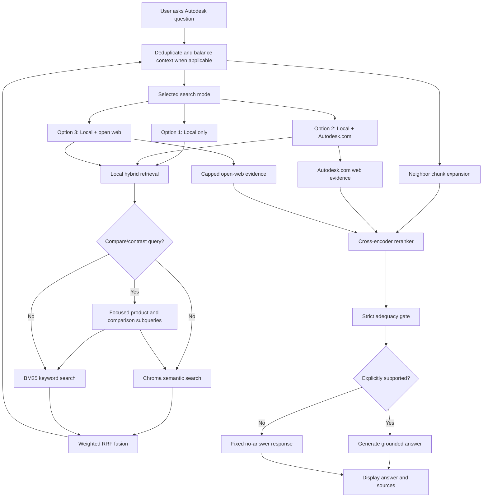
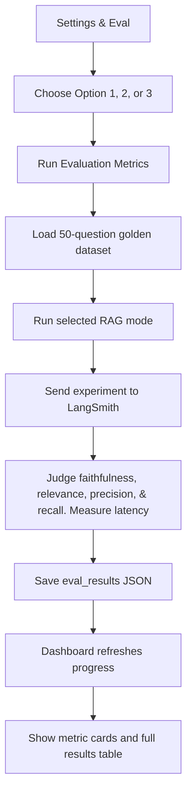

# Autodesk Agentic RAG High-Level Flowchart Blueprint

Use this file as a reviewer-friendly blueprint for infographics, presentation diagrams, and explanatory flowcharts. It intentionally simplifies the implementation while preserving the major decisions in the current app.

## Suggested Infographic Title

```text
Autodesk Agentic RAG: Evidence-Grounded Answers With Three Search Modes
```

## One-Sentence Summary

The app answers Autodesk product questions by retrieving local Autodesk corpus evidence, optionally adding web evidence, reranking the best evidence, checking whether it is sufficient, and then generating a short sourced answer or a conservative no-answer response.

For compare/contrast and product-selection questions, the app adds a local retrieval planning step that extracts the products mentioned in the user query and retrieves focused evidence for each product plus direct comparison dimensions. This improves context balance without hardcoding product pairs or pre-writing answers.

## Recommended Visual Layout

Use a horizontal or vertical five-layer diagram:

1. **User Interface**
2. **Search Mode Selection**
3. **Evidence Retrieval**
4. **Evidence Quality Control**
5. **Answer and Evaluation**

A good presentation slide can use:

- left side: main question-to-answer flow
- right side: three option comparison panel
- bottom ribbon: evaluation and reliability layer

## Layer 1: User Interface

### User Opens Streamlit App

- Three tabs:
  - Ask
  - Settings & Eval
  - About the App

### User Asks a Question

- User enters a natural-language Autodesk question.
- The app records the question in chat history.
- The selected search mode controls the retrieval path.
- The agent detects compare/contrast questions such as `Product A vs Product B`, `difference between Product A and Product B`, or `which should I use`.

Diagram node labels:

- `User asks Autodesk question`
- `Streamlit Ask tab`
- `Settings & Eval controls search mode`
- `Compare/contrast detector`

## Layer 2: Three Runtime Search Modes

Show these as three parallel branches.

| Option | Name | Web Policy | Best Use |
|---|---|---|---|
| 1 | Local Document Search | No web search | Fast local-corpus answers |
| 2 | Local + Autodesk.com | Always adds official Autodesk.com web evidence | Current official product, plan, version, pricing, and support information |
| 3 | Local + Open Web | Always adds capped open-web evidence | Broader corroboration when official-only web search may miss context |

Diagram node labels:

- `Option 1: Local only`
- `Option 2: Local + Autodesk.com`
- `Option 3: Local + capped open web`

Important visual note:

- Option 2 should look more authoritative than Option 3.
- Option 3 should show a small cap or filter icon to communicate latency/noise control.

## Layer 3: Local Evidence Retrieval

All three options use the same local retrieval backbone.

### Local Hybrid Retrieval

The app searches the local Autodesk corpus in two ways:

- **Chroma vector search** for semantic similarity.
- **BM25 keyword search** for exact product names, technical phrases, and enriched metadata keywords.

### Compare/Contrast Retrieval Planning

For compare/contrast questions, the app:

- extracts product or entity names from the user query;
- keeps the original question in the retrieval strategy;
- generates up to four focused retrieval subqueries for product-specific evidence, direct comparison evidence, and dimensions such as use cases, workflows, industries, features, interoperability, BIM/CAD differences, 2D/3D modeling, documentation, collaboration, and target users;
- retrieves each focused query through the same local hybrid Chroma plus BM25 path;
- deduplicates chunks and prefers balanced context across the compared products.

This planning step only changes evidence retrieval. It does not add product claims or answer templates.

### Fusion

- Dense and BM25 rankings are merged with weighted Reciprocal Rank Fusion.
- Vector retrieval receives more weight than BM25.
- Results are capped per source document to prevent one document from dominating.
- Compare/contrast results are deduplicated and balanced so one product does not dominate the context.

### Neighbor Expansion

- The app expands each selected local chunk with nearby chunks from the same document.
- It adds previous chunk, current chunk, and next chunk when available.
- It does not use full-page expansion.

Diagram node labels:

- `Compare retrieval planner`
- `Focused product subqueries`
- `Balanced comparison context`
- `Chroma semantic search`
- `BM25 keyword search`
- `Weighted RRF fusion`
- `Neighbor chunk expansion`

## Layer 4: Web Evidence Retrieval

Only Options 2 and 3 use web evidence.

### Option 2

- Runs SerpAPI search on every question.
- Restricts results to `autodesk.com/*`.
- Uses up to 5 official Autodesk web results.

### Option 3

- Runs SerpAPI search on every question.
- Allows open-web results.
- Caps results at 3 to reduce latency and noise.

Diagram node labels:

- `Autodesk.com web evidence`
- `Capped open-web evidence`
- `Web snippets become evidence blocks`

## Layer 5: Evidence Quality Control

### Cross-Encoder Reranker

- Local chunks and web snippets are reranked together.
- Model: `cross-encoder/ms-marco-MiniLM-L6-v2`.
- The reranker chooses the strongest evidence blocks before the adequacy gate.

### Strict Adequacy Gate

- Checks whether supplied evidence contains the exact fact needed.
- Does not answer the question.
- Does not use outside knowledge.
- If evidence is insufficient, the app refuses with the fixed no-answer sentence.

Diagram node labels:

- `Cross-encoder reranks evidence`
- `Strict adequacy gate`
- `Is the answer explicitly supported?`

## Layer 6: Answer Output

### If Evidence Is Sufficient

- The LLM generates a concise answer.
- The answer uses only supplied evidence.
- It includes inline source names, local source IDs, or URLs.
- It stays within 2-3 short paragraphs.

### If Evidence Is Insufficient

The app returns:

```text
I could not find a reliable answer in the available documents or web sources.
```

Diagram node labels:

- `Grounded answer`
- `Inline sources`
- `Fixed no-answer response`

## Reliability and Evaluation Layer

Show this as a bottom ribbon or side panel.

### Evaluation Dataset

- Fixed golden dataset:

```text
eval_testset/autodesk_testset.csv
```

- 50 questions.
- Covers simple lookup, reasoning, multi-context synthesis, and required reviewer questions.

### LangSmith Evaluation

- Each option can be evaluated from Settings & Eval.
- Runs are sent to LangSmith.
- Judge model: `gpt-5.1`.

### Metrics

- Faithfulness
- Answer relevance
- Context precision
- Context recall
- Latency: Avg, P50, P99

### Dashboard

- Polls evaluation status every 20 seconds.
- Preserves the Settings & Eval tab during refresh.
- Shows color-coded metric cards.
- Shows the full 50-question result table in golden dataset order.

Diagram node labels:

- `50-question golden dataset`
- `LangSmith experiment`
- `Quality metrics`
- `Latency metrics`
- `Evaluation dashboard`

## Cleaning and Indexing Support Layer

This can be shown as a smaller setup pipeline before the runtime diagram.

### Corpus Cleaning

```text
Raw Autodesk HTML
    -> BeautifulSoup cleanup
    -> Trafilatura extraction
    -> Markdown with enriched front matter
    -> Purge tiny and non-English files
    -> cleaned_corpus/
```

Enriched front matter includes:

- title
- source file
- headings
- subheadings
- document language
- TF-IDF keywords
- cleaned character count

### Index Building

```text
cleaned_corpus/
    -> Docling-aware chunking
    -> Chroma vector index
    -> BM25 keyword index with enriched metadata text
    -> retrieval_indexes/
```

Diagram node labels:

- `Clean raw HTML`
- `Enrich metadata without LLM`
- `Purge low-value files`
- `Build Chroma`
- `Build BM25`

## Main Runtime Mermaid Diagram



## High-Level Evaluation Mermaid Diagram



## Compact Option Comparison for Infographics

```text
Option 1
Local only
Fastest and most controlled

Option 2
Local + Autodesk.com
Best for official current Autodesk facts

Option 3
Local + capped open web
Broader, but less authoritative
```

## Keywords for Diagram Callouts

- Local Autodesk corpus
- Chroma vector search
- BM25 keyword search
- Compare/contrast retrieval planning
- Focused product subqueries
- Balanced comparison context
- Enriched metadata keywords
- Weighted RRF fusion
- Neighbor context expansion
- Autodesk.com web evidence
- Capped open web
- Cross-encoder reranking
- Strict adequacy gate
- Source-grounded answer
- Fixed no-answer fallback
- LangSmith evaluation
- 50-question golden dataset
